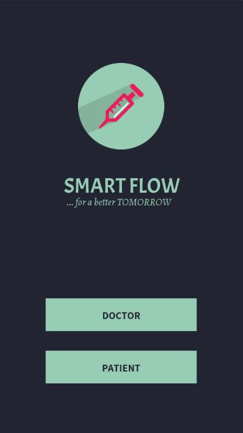
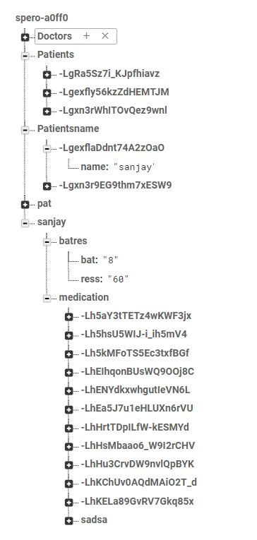
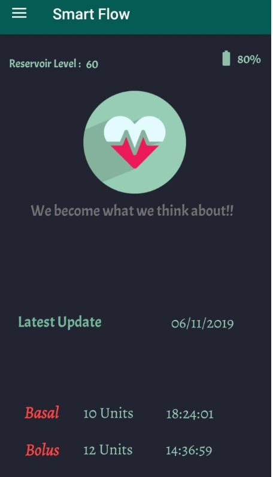

# Smart Insulin Pump

The Smart insulin pump is a Project sponsored by **Spero Electrics**.

The main aim is to provide a solution that is cost effective and to provide least pain to the users.We have also visited Doctors and Patients to validate the problem. The problem is validated only after the Customer Discovery, Challeng Brief and Value Propositon is proven. The whole process is carried out through iTools which is an innovative toolkit of Forge Accelarator.

Smart Insulin Pump is an attempt to built an MUP(Minimum Usable Prototype) with four members in the team, that proves the concept of a working insulin pump to provides accurate amount of insulin(both basal/bolas) whenevery necessary.

In this repo I have uploading the application that is used by the patients and the doctors to monitor their insulin intake. The doctors on a whole can monitor of his patients insulin intake and can provide suggestions based on it. This application is build in reference with various other Insulin pump Applications (like Medtronic, T:slim, etc,.) and the main idea is to provide a user friendly experience for the patient/doctor.

**Selection Page**

The Doctor / Patient will choose their selection within this Activity.

The doctors can login into the next activity.
Incase if the Doctor doesnt have  an account he can signup.
Every details are stored in the firebase cloud.
Each doctor is given a unique code.
,

The patients can login into the next activity.
Incase if the patient doesnt have an account he can signup.
Every details are stored in the firebase cloud.
The patient can enter into the doctors connection using the doctor's code and the code will be given by the doctor.

Fire Base Database :
This is the Cloud Database where the data is pushed from the pump.

The patient can view the basal and bolus amount taken by him along with the time is displayed in the app.

The patient will also be notified when the reservoir level or the battery level falls below the minimum level.

